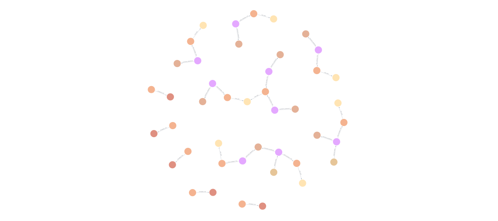
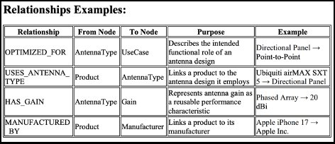

# AntennaDB

A graph model of antenna performance — gain, environment, and materials — as relationships instead of fixed specs.



## Why a graph

Antenna gain is usually listed as a single fixed number. In practice, performance depends on antenna type, what it's optimized for, the materials it's built from, and what it has to transmit through. AntennaDB models these as relationships in Neo4j, so performance can be queried in context instead of treated as an isolated spec.

## Schema



| Relationship        | From        | To           | Example                                   |
| ------------------- | ----------- | ------------ | ----------------------------------------- |
| `OPTIMIZED_FOR`     | AntennaType | UseCase      | Directional Panel → Point-to-Point        |
| `USES_ANTENNA_TYPE` | Product     | AntennaType  | Ubiquiti airMAX SXT 5 → Directional Panel |
| `HAS_GAIN`          | AntennaType | Gain         | Phased Array → 20 dBi                     |
| `MANUFACTURED_BY`   | Product     | Manufacturer | Apple iPhone 17 → Apple Inc.              |

50 nodes, 33 relationships across `AntennaType`, `Gain`, `Manufacturer`, `Product`, `RadioInterface`, and `UseCase`.

## Explore the data

The full graph export is in [`data/antennadb_export.cypher`](data/antennadb_export.cypher) — a Cypher script that rebuilds the database from scratch.

**To load it:**

1. Install [Neo4j Desktop](https://neo4j.com/download/) (free) and create a new empty database, e.g. `antennaproducts`
2. Open Neo4j Browser and run:
   ```
   :source data/antennadb_export.cypher
   ```
3. View the full graph:
   ```cypher
   MATCH (n)-[r]->(m) RETURN n, r, m
   ```

## Sample queries

Compare gain across device classes:

```cypher
MATCH (a:AntennaType)-[:HAS_GAIN]->(g:Gain)
RETURN a.antennaTypeId, g.value
ORDER BY g.value;
```

Find commercial-grade directional antennas (≥10 dBi):

```cypher
MATCH (a:AntennaType)-[:HAS_GAIN]->(g:Gain)
WHERE a.coverageType = 'Directional' AND g.value >= 10
RETURN a.antennaTypeId, g.value;
```

More queries in [`queries/sample_queries.cypher`](queries/sample_queries.cypher).

## Source

Device specs cross-referenced against the [FCC Equipment Authorization Search](https://www.fcc.gov/licensing-databases/search-fcc-databases).

## Author

Isaiah Scott — DIGS Data Management, University of Chicago, Autumn 2025
